**Project Setup**

# **Setup NodeJS for Windows**

    1. **Install NodeJS**

To download Node, go to [nodejs.org](http://nodejs.org/), click "Download", and click “Windows Installer”. This will give you a Windows Installer (MSI) file that will install Node and npm.

Running the Windows installer will show a wizard, it’s pretty easy to follow. It’s just like installing any other Windows program – the Node binaries will end up in **C:\Program Files (x86)\nodejs\**, and will be accessible from **cmd.exe**.

# **Setup Eclipse for AngularJS and GIT**

Refer to the link: [https://github.com/angelozerr/angularjs-eclipse](https://github.com/angelozerr/angularjs-eclipse) to setup you AngularJS plugin. 

    2. **[Getting Started**:](https://github.com/angelozerr/angularjs-eclipse/wiki/Getting-Started)** **

[https://github.com/angelozerr/angularjs-eclipse/wiki/Getting-Started](https://github.com/angelozerr/angularjs-eclipse/wiki/Getting-Started) 

How to install and configure AngularJS Eclipse, this Eclipse plugin is based on the powerful javascript inference engine [tern.js](http://ternjs.net/) which is written in javascript. To use this engine on Java context, tern.java is used. It executes [tern.js](http://ternjs.net/) with [node.js](http://nodejs.org/). That's why you will see that, you must [install node.js](#heading=h.gjdgxs)server or use an embed [node.js](http://nodejs.org/).

If you don't [install node.js](#heading=h.gjdgxs)or don't use an embed node.js, only syntax coloring and completions directives will be available in HTML editor.

        1. **Installation**

AngularJS Eclipse is developped/tested with Eclipse Kepler. It is adwised to use Kepler (even if AngularJS Eclipse could work with older version of Eclipse).

To install AngularJS Eclipse, please read [Installation - Update Site](https://github.com/angelozerr/angularjs-eclipse/wiki/Installation---Update-Site) section.

When you will use AngularJS Eclipse update site you will see that:

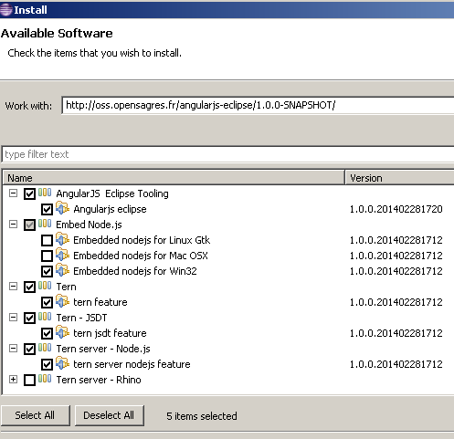

You must select:

* **AngularJS Eclipse Tooling** which is AngularJS Eclipse plugins .

* select the well Embed Node.js according your OS, only if you have not [node.js](http://nodejs.org/) installed on your computer.

* **Tern** to use tern with Eclipse IDE.

* **Tern - JSDT** to benefit with angular (jquery, etc) completions and hyperlink in Javascript JSDT Editor.

* **Tern - server - Node.js** to use tern with [node.js](http://nodejs.org/).

        2. **AngularJS Configuration**

Before using AngularJS Eclipse features ([HTML features](https://github.com/angelozerr/angularjs-eclipse/wiki/HTML-Features) and [Javascript features](https://github.com/angelozerr/angularjs-eclipse/wiki/Javascript-Features)) you must convert your project to AngularJS Project :

            1. **_[HTML Feature_**s](https://github.com/angelozerr/angularjs-eclipse/wiki/HTML-Features)

            2. **_Syntax Coloring_**

Highlight AngularJS directive and EL:

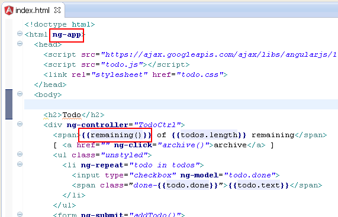

            3. **_Directive management_**

Completion for directive name :

You can configure directives syntax in order to that completion shows you the well directive names (ng-, ng_, etc).

                1. Customize Directives syntax

In HTML editor, directives completion provides directive names with the ng-* syntax :

Angular supports several syntax like starting with 'x-', 'data-' and use ':', '-', '_' delimiters. You can customize the syntax that you wish for completion with the project properties. By default you will see this configuration :

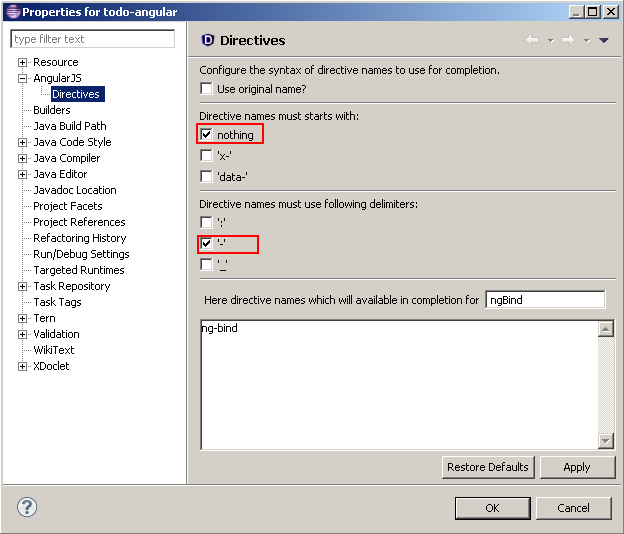

You can select other starts with and delimiters. You can see in the textarea the directive names that completion will show :

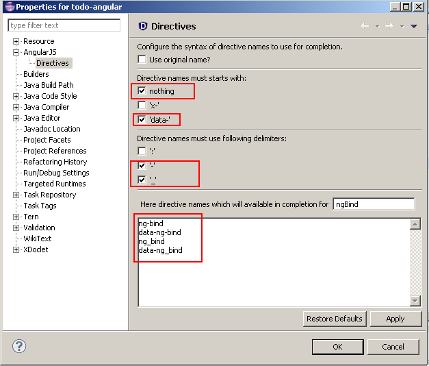

After validating your configuration, completion will show you directive names with other syntaxes :

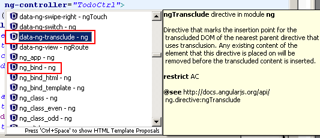

                2. Completion by tags

Some directive supports only some HTML elements. For instance ngModel can be used only for 'inpu' HTML element. The completion shows ngModel only for 'input' element.

                3. Completion by restrict

Angular defines 4 restricts :

* A : the directive is available for attribute.

* C : the directive is available for class attribute value.

* E : the directive is available for element.

* M : the directive is available for comment.

                4. Completion for directive parameters

Some directive have parameters. A good sample is the [ngPluralize](http://docs.angularjs.org/api/ng.directive:ngPluralize) directive which defines required parameters like 'count', 'when' and optional 'offset' parameter:

If you open completion inside HTML element, you will see ngPluralize :

When you apply the completion on ngPluralize, 'count' and 'when' attribute are generated because there are required :

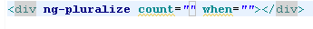

Directive parameters are highlighted with a light blue color.

If you open completion inside the HTML element, you can see 'offset' directive parameter :

ngPluralize can be used as element (restrict=EA), you can benefit too with completion for HTML element.

When you apply the completion on ngPluralize, 'count' and 'when' attribute are generated because there are required :

            4. **_Hover_**

            5. **_Custom Directive_**

                5. Completions

Completion for custom directive name :

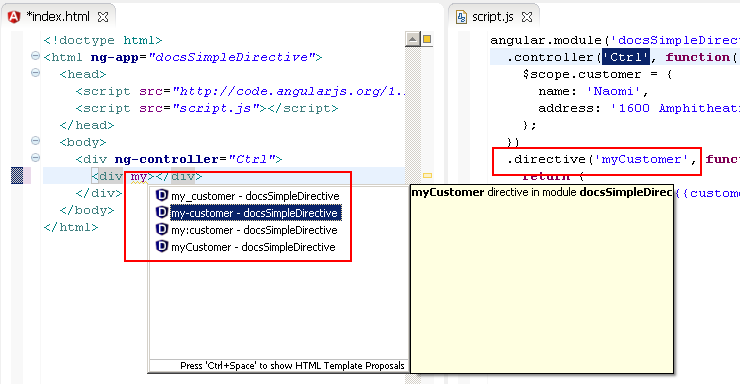

                6. Hyperlink

Hyperlink for custom directive name :

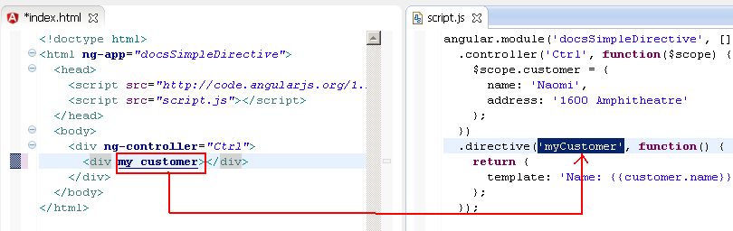

            6. **_[Tern Eclipse IDE - Node.j_**s](https://github.com/angelozerr/tern.java/wiki/Tern-Eclipse-IDE-Node.js)

To execute Tern (written in Javascript) it is recommanded to execute it with Node.js. Tern Eclipse IDE gives you preference page to configure Tern with Node.js.

                7. Tern with Node.js

Open Preferences with the menu Windows/Preferences and select Tern node tree :

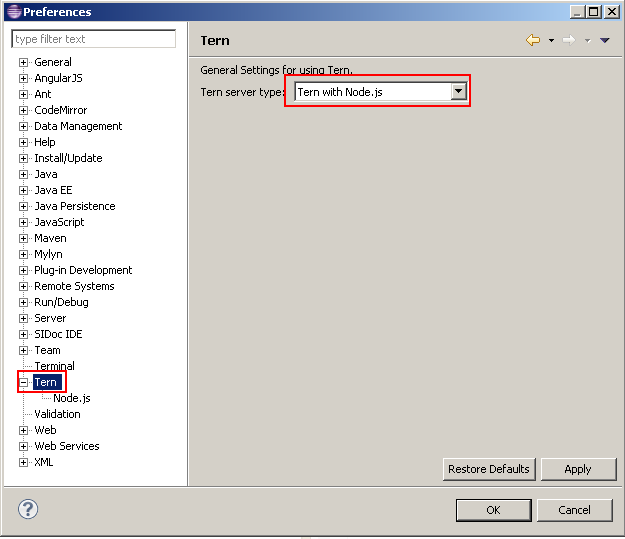

                8. Configure Node.js

After selecting Tern with node.js, you must configure the node.js runtime process. To do that go to the Tern->Node.js node tree.

                9. Native Node.js

If you have [installed node.js](http://nodejs.org/), select "Native Node.js" :

IMPORTANT : if you have installed node.js, please restart your computer before using the Tern Eclipse IDE.

                10. Embed Node.js

If you have not installed node.js, you can select according your OS, (if it's available) the embed node.js install :

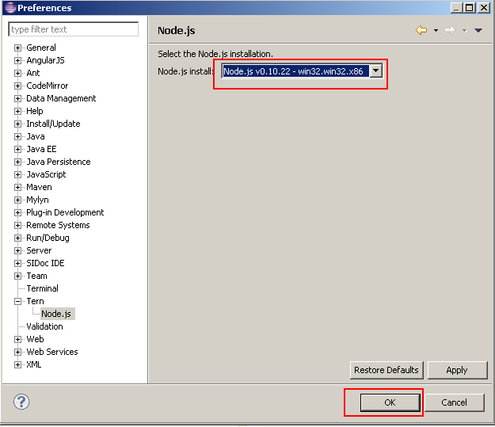

            7. **_Module management_**

For module management, you need to configure tern server.

                11. Hyperlink

                12. Hover

                13. Completions

Completion for modules (declared in an external JS) :

            8. **_Controller management_**

For controller management, you need to configure tern server.

                14. Completions

Completion for controllers (declared in an external JS) :

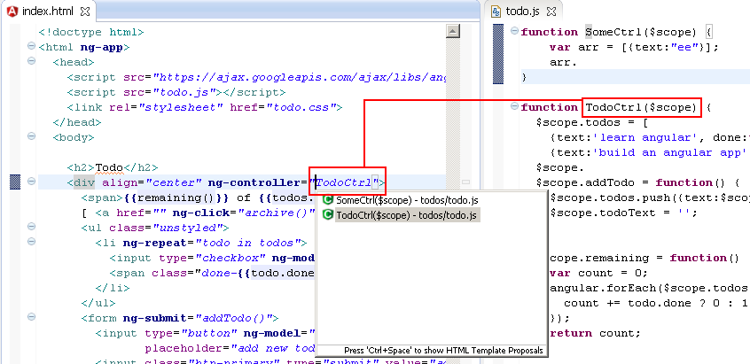

                15. Hover

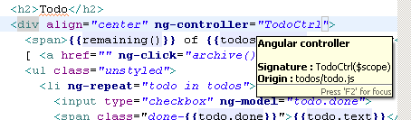

                16. Hyperlink

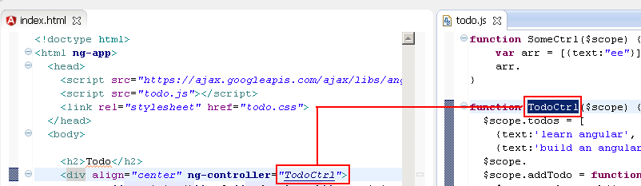

            9. **_Angular Expression management_**

For angular expression management, you need to configure tern server.

                17. Completions

Completion for angular expression :

            10. **_Typing_**

                18. Auto close EL

 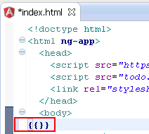

                19. Validation

Imagine you have this valid HTML Angular file (module and controller exists) :

If you fill ng-app with bad module, you will see this validation error :

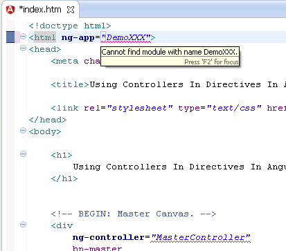

If you fill ng-app with existing module, but a controller which doesn't exists, you will see this validation error :

        3. **[Javascript Feature**s](https://github.com/angelozerr/angularjs-eclipse/wiki/Javascript-Features)

            11. **_JSDT Editor_**

Tern.java extends the JSDT plugins to use tern completion, hyperlinks with the JSDT Javascript Editor.

Note : it should be possible to extend other Javascript editor with tern by developping a plugin eclipse.

            12. **_Completions_**

                20. Angular

Completion on angular variable :

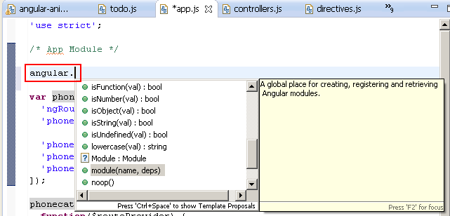

Completion on angular module :

Completion on angular elements like $http :

Completion on injected service :

                21. Javascript

Completion on javascript elements like array :

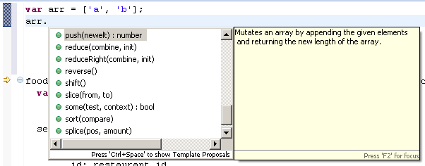

            13. **_Hyperlink_**

Ctrl+Click on any javascript elements (variable, function) open hyperlink :

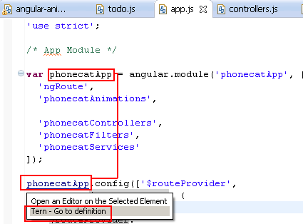

If you select "Tern - Go to definition", tern is used to search and select the javascript definition:

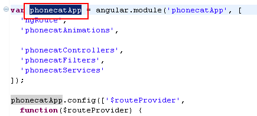

It works too if your variable, functions is defined on other files (if script path is well configured).

        4. **Preferences Settings**

This section explains how to configure tern and angular.

            14. **_Global Preferences_**

This section is about "global preferences" dialog that you open with **Window/Preferences.**

                22. Node.js

AngularJS Eclipse is based on the javascript inference engine tern.js is written in Javascript. To use it, tern is executed with node.js (Rhino is too slow for that). You must configure node.js. To do that you can:

* use your installed node.js. For that, you must select the "Native node" install type and select the well node file :

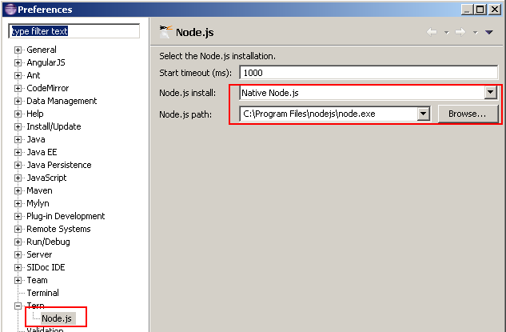

when the native node is selected, it searches node binary in default folders installation (ex : "C:\Program Files\nodejs\node.exe" for Windows) and if it doesn't find, it searches in your node in your "PATH" environment.

If you wish to [download and install node.js](#heading=h.gjdgxs)[,](#heading=h.gjdgxs) it's important to restart your computer before using AngularJS Eclipse in order to your OS update correctly your "PATH" environment with your installed node.js.

* use an embed node. For that you must install the well embed node.js according your OS :

            15. **_Project preferences_**

This section is about "project properties" dialog which is available if you select your project and use "Properties" menu item of the contextual menu (or Alt/Enter).

                23. Tern Plugins

tern.js provides several [Tern Plugin](http://ternjs.net/doc/manual.html#plugins). Check that angular plugin is checked

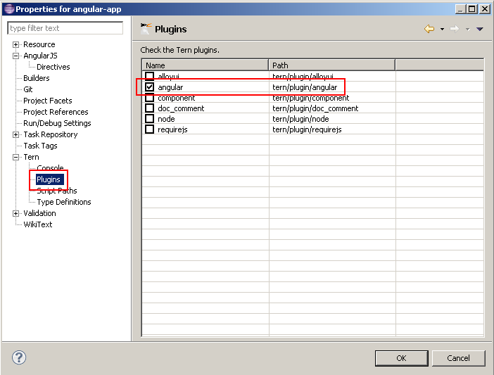

The angular plugin gives you the capability to retrieve module, controllers,(custom) directives, etc from your javascript, manages completion hyperlink, hover, validation in HTML and Javascript editor. It's enable to emulate the angular injection on your $scope, $http, etc.

                24. JSON Tern definitions

tern.js provides several [JSON Type definition](http://ternjs.net/doc/manual.html#typedef). If you wish to benefit with completion about browser model (ex: document.get...), select it. It provides too an ecma5, jquery definition. For angular, the definition is inside the angular plugin.

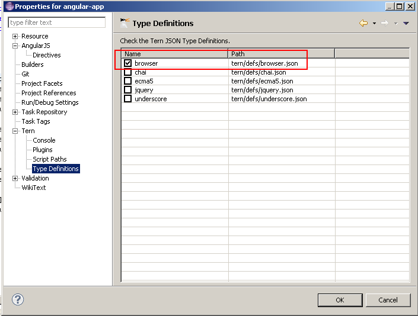

                25. Scripts path

When tern is used for completion, validation, hover, hyperlink, it must load before (just the first time) a list of your Javascript. To do that you must configure your script paths by selecting your js folder which contains your javascripts (it's the same thing than for Java build path) :

                26. Customize Directives syntax

In HTML editor, directives completion provides directive names with the ng-* syntax :

Angular supports several syntax like starting with 'x-', 'data-' and use ':', '-', '_' delimiters. You can customize the syntax that you wish for completion with the project properties. By default you will see this configuration :

After validating your configuration, completion will show you directive names with other syntaxes :

                27. Validation

If you validate with "Validate" menu contextual menu :

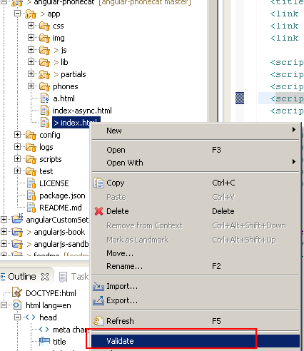

you will see that AngularJS directives will have warn messages :

In this sample you have 2 warnings messages :

* a warning with ng-app which is an Angular directive

* a warning with "a" attribute in the head element which doesn't exist.

You could disable the warning message for unknown attribute, but AngularJS Eclipse provides the "HTML Angular Syntax Validator" which is an extension of the "HTML Syntax Validator" to support Angular directives. To use this Angular validator, you must enable it and disable "HTML Syntax Validator":

If you revalidate you will see that directive are not marked as warning and other unknown attributes are marked as warning:

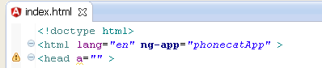

        5. **Let's go!**

At this step we have finished to configure AngularJS Eclipse, now it's time to check that everything works (tern with node.js is well configured).

            16. **_HTML Editor_**

Open an HTML file by using **Open with/AngularJS Editor:**

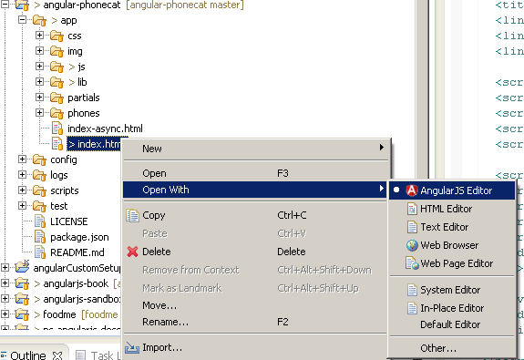

If you open your HTML file without this editor, you will have not angular syntax coloration, but completion, hyperlink should working.

Try completion on ng-app to open your module:

This feature is managed by tern, if it doesn't work, see [Troubleshooting](#heading=h.3znysh7)section.

        6. **Javascript Editor**

Open a javascript editor and try to open completion for angular model:

This feature is managed by tern, if it doesn't work, see [Troubleshooting](#heading=h.3znysh7)section.

        7. **Troubleshooting**

If you have checked your configuration and completion doesn't work for HTML and Javascript editor, it means that there is a problem with tern with node.js. To verify that you can see errors with:

* Error log view.

* Tern console

            17. **_Error log view_**

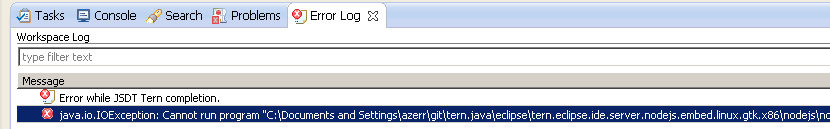

            18. **_Tern console_**

You can trace the start of node.js server and the request/response of the tern server by using the Eclipse console.

To do that, you must active the tern console for your project:

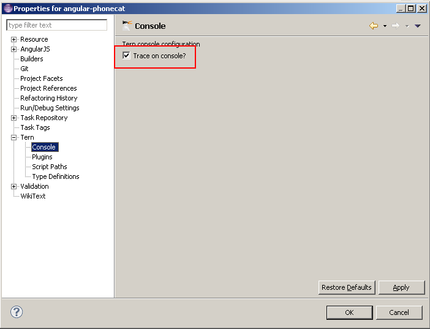

and open the tern console:

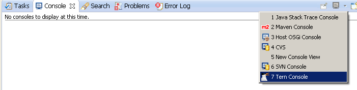

If you retry to execute completion for instance to use tern server, you will see the node.js command and the error in the console:

When you have no problem, you can see the JSON request/response of the tern server when it is use it:

        8. **[Angular Explore**r](https://github.com/angelozerr/angularjs-eclipse/wiki/Angular-Explorer-View)

Angular Explorer View gives you the capability to display Angular elements like modules, controllers of your AngularJS application. To open it go to **Window/Show View** and select **Angular Explorer:**

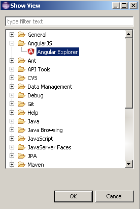

After that you can see your modules, controllers, etc:

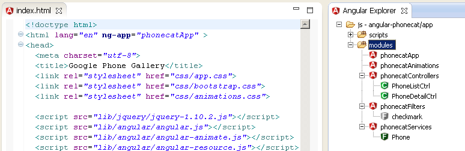

            19. **_Angular Explorer View_**

Angular Explorer View gives you the capability to display Angular elements like modules, controllers of your AngularJS application:

This view is useful for :

* display modules, controllers, etc in a view and go to the definition if you double click on it (open the JS editor and select the module, controller).

* AngularJS "HTML templates" where module and controller is not defined inside the HTML. So you can link module and controller to the current HTML editor to benefit with Angular expression completion.

            20. **_How to configure the view?_**

                28. Define script path

To use Angular Explorer View, you must defines the whole Javascripts files which must be used to load with Tern the Angular modules, controllers. To do that you must configure Script path. Here a screenshot where script path was configured with an HTML file which defines "script" elements by using "Add File" button:

You can define a folder with "Add Folder" which contains the Javascript files to load. This configuration is used when your scripts to load are not declared in script element (or if script/@src cannot be resolved if you use for instance JSP EL contextPath).

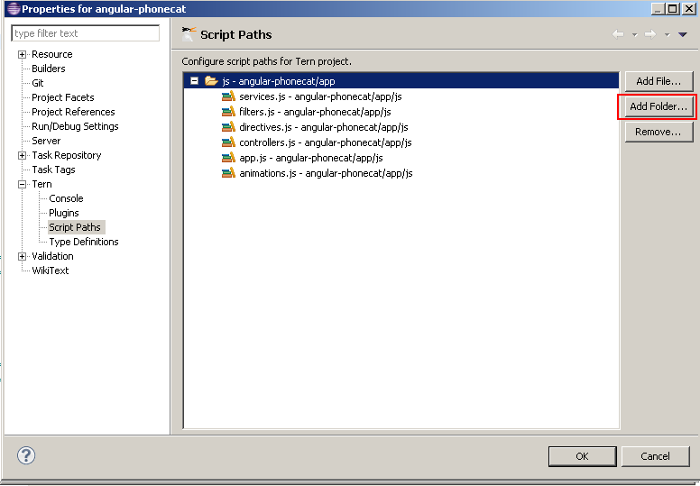

            21. **_Use the Angular Explorer view?_**

                29. Go To Definition

The "Go To Definition" contextual menu gives the capability to open the JS editor and select the module, controller selected (you can do that too with double click):

                30. HTML Template (Link/Unlink)

No completion: 

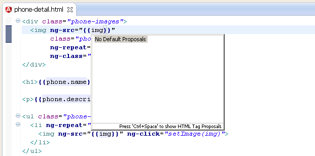

To resolve this problem, you can link the HTML file to a controller with "Link to controller" menu action:

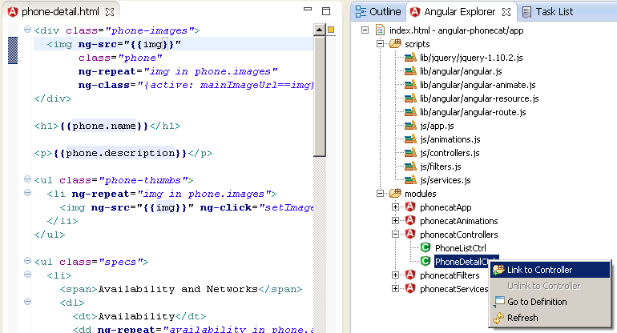

If you reopen completion, you will see completion :

# **Setup Github**

